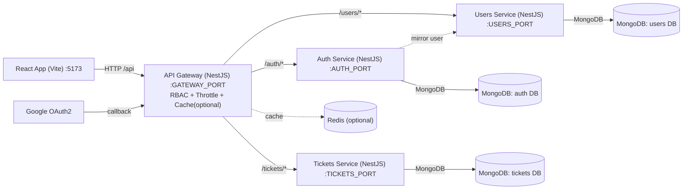

Ticketing Backend (NestJS Monorepo)

- Apps: `api-gateway`, `auth-service`, `users-service`, `tickets-service`
- Tech: NestJS, Mongoose, JWT, Passport OAuth (Google), Redis cache (optional), Throttling, RBAC (shared lib)

Overview

This backend is a small NestJS microservices monorepo:
- `api-gateway`: Single entrypoint for the frontend. Provides `/api` prefix, RBAC guard, rate limiting, optional Redis cache, and OAuth initiation/callback. Proxies to services over HTTP.
- `auth-service`: Issues JWTs, manages user identities/roles; mirrors user records into `users-service` for admin listing.
- `users-service`: CRUD for users (for admin UI).
- `tickets-service`: CRUD for tickets.

Environment variables

Place a single `.env` file at `backend/.env`. All apps read from process environment.

Required

- BACKEND_URL: Base URL used for service-to-service HTTP calls. Example: `http://localhost`
- GATEWAY_PORT: Port for the API Gateway. Default: `3000`
- AUTH_PORT: Port for `auth-service`. Default: `3011`
- USERS_PORT: Port for `users-service`. Default: `3012`
- TICKETS_PORT: Port for `tickets-service`. Default: `3013`
- MONGO_URI: MongoDB connection string used by all services. Example: `mongodb://localhost:27017/utms`
- JWT_SECRET: Secret used to sign JWTs. Example: `change-me`
- JWT_EXPIRES_IN: JWT lifetime. Example: `7d`

Optional

- THROTTLE_TTL: Rate limit window in seconds. Default: `60`
- THROTTLE_LIMIT: Allowed requests per window. Default: `60`
- REDIS_URL: If set, enables Redis-backed cache at the gateway. Example: `redis://localhost:6379`
- FRONTEND_REDIRECT_URL: Where the gateway redirects after OAuth success. Example: `http://localhost:5173/`
- ADMIN_EMAILS : This is comma seprate value Example: `aaa@gamil.com, bbb@yahoo.com`
- GOOGLE_CLIENT_ID, GOOGLE_CLIENT_SECRET: Google OAuth credentials
- GOOGLE_CALLBACK_URL: OAuth callback URL handled by the gateway. Example: `http://localhost:3000/api/auth/google/callback`
- ADMIN_EMAILS: Comma-separated list that should receive the `admin` role. Example: `admin@example.com`

Example .env (backend/.env)

```bash
BACKEND_URL=http://localhost

GATEWAY_PORT=3000

AUTH_PORT=3011
USERS_PORT=3012
TICKETS_PORT=3013

MONGO_URI=mongodb://localhost:27017/utms

JWT_SECRET=change-me
JWT_EXPIRES_IN=7d

THROTTLE_TTL=60
THROTTLE_LIMIT=60
# REDIS_URL=redis://localhost:6379

FRONTEND_REDIRECT_URL=http://localhost:5173/
GOOGLE_CLIENT_ID=your-google-client-id
GOOGLE_CLIENT_SECRET=your-google-client-secret
GOOGLE_CALLBACK_URL=http://localhost:3000/api/auth/google/callback

ADMIN_EMAILS=admin@example.com
```

Install and run

1. Node.js 18+ and MongoDB running locally
2. From `backend/`: `npm install`
3. Start all services in watch mode: `npm run start`
   - Or individually: `npm run start:gateway`, `npm run start:auth`, `npm run start:users`, `npm run start:tickets`

Service ports and base paths

- Gateway: `http://localhost:${GATEWAY_PORT}/api`
- Auth Service: `http://localhost:${AUTH_PORT}` (proxied by gateway `/api/auth/*`)
- Users Service: `http://localhost:${USERS_PORT}` (proxied by gateway `/api/users/*`)
- Tickets Service: `http://localhost:${TICKETS_PORT}` (proxied by gateway `/api/tickets/*`)

Key endpoints (via gateway)

- `POST /api/auth/login`
- `GET /api/auth/me`
- `GET /api/auth/google` and `GET /api/auth/google/callback`
- `GET/POST/PATCH/DELETE /api/users`
- `GET/POST/PATCH/DELETE /api/tickets`

Architecture diagram



Notes

- The gateway sets a global prefix `/api`. Point the frontend to `http://localhost:3000/api` (see frontend `.env`).
- OAuth success redirects to `FRONTEND_REDIRECT_URL` with `?token=...` query param; the frontend consumes it and stores to localStorage.
- If `REDIS_URL` is not set, gateway falls back to an in-memory cache.

Assumptions

- A single `.env` at `backend/.env` is read by all apps in the monorepo.
- A single MongoDB instance is used with separate collections; a single `MONGO_URI` is sufficient for local dev.
- `BACKEND_URL` is reachable from all services and the gateway (e.g., `http://localhost`).
- Only Google OAuth is enabled; other providers would require similar envs and strategies.

